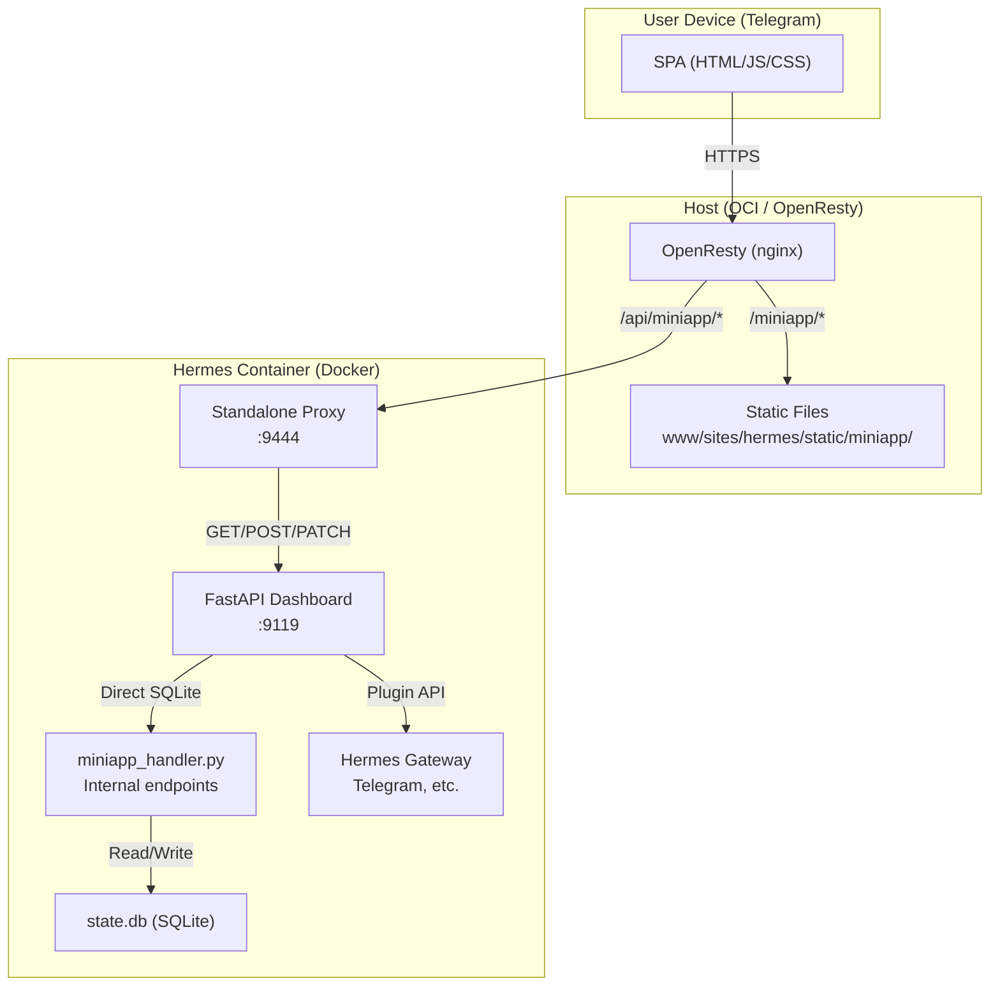

# HERMES Telegram Mini App

A Telegram Mini App for managing Hermes Agent sessions, kanban boards, and tasks from your phone.

## Overview

This Mini App provides a mobile-optimized interface for:

- **Kanban** — View and manage kanban boards (single-column layout)
- **Tasks** — View tasks grouped by status
- **Sessions** — Browse, filter (server-side by source), rename, and inspect Hermes agent sessions
- **Chat** — Chat interface (coming soon)
- **Dashboard/WebUI** — External redirects to full desktop interfaces

## Architecture



## File Structure

```
/opt/data/miniapp/          # ← Git repo (source of truth)
├── index.html              # SPA entry point
├── js/
│   ├── app.js              # App init + Telegram SDK
│   ├── router.js           # Hash-based SPA router
│   ├── config.js           # Client configuration
│   ├── utils/
│   │   ├── api.js          # API client (X-Telegram-Init-Data auth)
│   │   ├── telegram.js     # Telegram WebApp SDK helpers
│   │   └── theme.js        # Theme color mapping
│   └── pages/
│       ├── kanban.js       # Kanban (single-column + long-press drag)
│       ├── tasks.js        # Tasks (grouped by status)
│       ├── sessions.js     # Sessions (filters, badges, rename)
│       ├── redirects.js    # Dashboard/WebUI external redirects
├── css/
│   ├── theme.css           # CSS variables (Telegram theme)
│   ├── layout.css          # Shell layout + components
│   └── pages/
│       ├── kanban.css
│       ├── tasks.css
│       ├── sessions.css
│       └── redirects.css
├── assets/                 # Static assets (images, icons)
├── proxy/
│   └── miniapp-api-proxy.py  # Standalone API proxy (port 9444)
├── dashboard/
│   └── miniapp_handler.py    # Dashboard-embedded routes
├── README.md
├── ARCHITECTURE.md
└── TODO.md
```

## Deployment

The SPA is served from **OpenResty** on the host at:

```
/opt/1panel/apps/openresty/openresty/www/sites/hermes/static/miniapp/
```

### Deploy flow

```bash
# 1. Build/test in repo
cd /opt/data/miniapp
git add .
git commit -m "..."
# 2. Copy to OpenResty (requires sudo on host)
sudo cp -r /opt/data/miniapp/* /opt/1panel/apps/openresty/openresty/www/sites/hermes/static/miniapp/
# 3. Bump CSS/JS version in index.html (update ?v=N)
# 4. Reload OpenResty
sudo docker exec 1Panel-openresty-iX4n nginx -s reload
```

### Backend services

| Service | Port | Description |
|---------|------|-------------|
| Hermes Dashboard | :9119 | FastAPI backend (internal) |
| Miniapp Proxy | :9444 | Standalone Python proxy (127.0.0.1 only) |
| OpenResty | :443 | HTTPS termination + reverse proxy |

## Authentication

- **Telegram Mini App**: Uses `X-Telegram-Init-Data` header (HMAC-SHA256 validated)
- **Dashboard**: Uses `X-Hermes-Session-Token` (scraped from dashboard HTML)
- **Proxy auth flow**: SPA → Telegram initData → Proxy → Dashboard session token

## Routes (nginx)

```nginx
# Static SPA
location /miniapp/ {
    root /www/sites/hermes/static;
    try_files $uri $uri/ /miniapp/index.html;
}

# API proxy
location /api/miniapp/ {
    proxy_pass http://127.0.0.1:9444/;
}

# External redirects
location = /miniapp/dashboard { return 302 https://hermes.cloudinthenight.duckdns.org/; }
location = /miniapp/webui { return 302 https://cloudinthenight.duckdns.org/webui/; }
```
